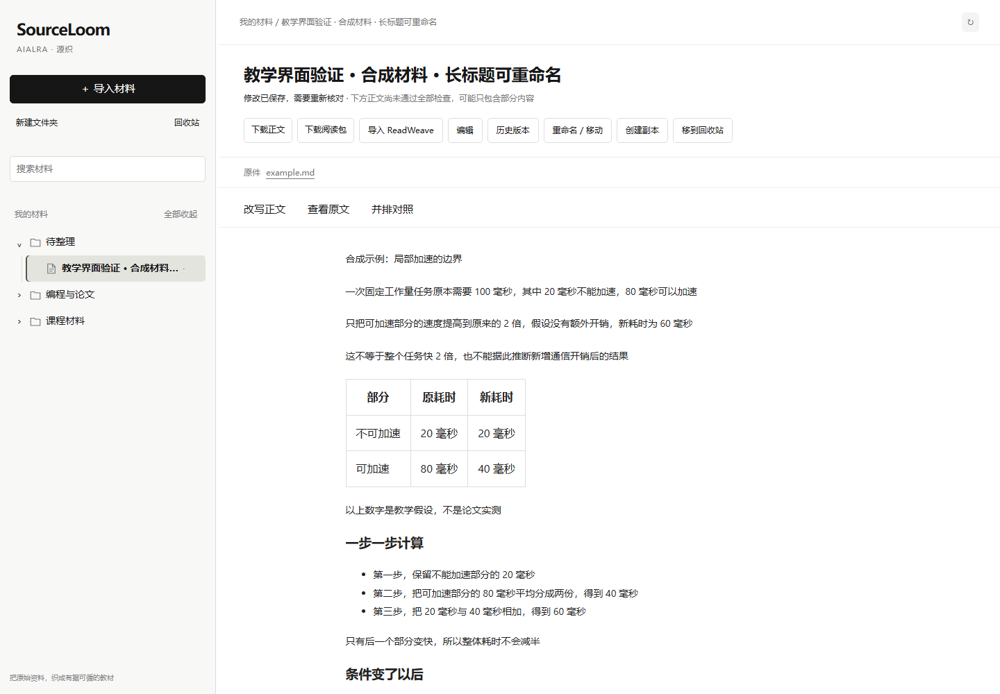

<div align="center">

<h1>AIALRA SourceLoom</h1>

<p><strong>Turn source material into traceable learning content</strong></p>

<p>Content preparation for ReadWeave · Automatic production under evaluation</p>

[中文](README.md) · [Actual trials](reports/AUTOMATIC_TRIAL.md) · [Master plan](docs/MASTER_PLAN.md) · [Deployment](deploy/README.md)

</div>

## 1 Current results

SourceLoom preserves originals and separates inventory, planning, writing, review, and local repair before preparing material for ReadWeave

Teaching planning and the document library have been updated, and 24 real materials have been collected and ingested. There are still **zero formally accepted automatic outputs**; existing automatic drafts have not passed every requirement. See [real inputs, outputs, and independent review results](reports/AUTOMATIC_TRIAL.md)

Earlier manually revised examples remain [historical examples](docs/REAL_CASES.md), not evidence of unattended automatic quality

<div align="center">



Figure 1.1 The actual library interface, using synthetic material to demonstrate document management and object rendering

</div>

## 2 Using the library

1. Import a paper, webpage, document, or archive containing its assets
2. Save it in a folder and inspect the original
3. Configure a provider and start generation; the server keeps processing after the page closes
4. Reopen the material to compare its source and available output; click a right-hand section to locate its source on the left. Stopped jobs keep any drafts already produced
5. Download the text or send an eligible candidate archive to ReadWeave

Rename, move, duplicate, trash, and restore documents. Editing saves a new version and invalidates previous acceptance

The tree supports context menus, keyboard navigation, multi-selection and nested-folder restoration. The full-document editor autosaves and detects concurrent edits. See [teaching and library changes](docs/TEACHING_AND_LIBRARY.md)

See [the current iteration](docs/ITERATION_3.md) for long-source preflight, source navigation, and measured performance

## 3 Run locally

Requires Python 3.11 or later

```bash
# Create an isolated environment
python -m venv .venv
```

Activate it with `.venv/Scripts/Activate.ps1` on Windows or `source .venv/bin/activate` elsewhere

```bash
# Install the application
python -m pip install .

# Start the local library, listening on port 8765 by default
python -m sourceloom.cli serve
```

Open the local address printed by the server. In another terminal with the same configuration and data directory:

```bash
# Process persisted jobs independently of the browser
python -m sourceloom.cli worker
```

Without a configured provider, the library stores and manages material but explains why generation is unavailable

## 4 Full writing skill and providers

Copy [the example configuration](config.example.json) to a private location. Set `SOURCELOOM_CONFIG` to that file and `SOURCELOOM_DATA` to the material directory

Point `writing_skill_dir` at the complete [Chinese technical writing skill](https://github.com/AIALRA-0/agent-human-readable-technical-writing). Every role receives the unabridged effective instruction files, while the entire package is frozen alongside the job. See [delivery details](docs/SKILL_RUNTIME.md)

Receiving instructions does not prove compliance. Formal output requires teaching review, writing review, and independent source comparison of the same draft revision. Unreviewed output remains a draft

Automatic jobs allow at most 24 calls and two prose repair rounds per document. There is no default document or project elapsed-time limit; individual network requests remain bounded. The default document budget is $0.20. Trial limits and unknown subscription costs are recorded in [the trial report](reports/AUTOMATIC_TRIAL.md)

## 5 Verified scope and limits

- Deterministic tests cover folders, document management, versions, trash, and persistent job recovery
- Web intake stores original HTML and bounded raster downloads; missing assets remain explicit gaps, and dynamic pages are not comprehensively supported
- Ordinary word-processing documents expose text, tables, links, and media; complex equations, tracked changes, and unsupported objects remain explicit gaps
- One synthetic mixed document completed real ReadWeave import, editing, saving, and reopening with repeated images, tables, code, math, paragraph anchors, and footnote targets preserved
- The 24-document real and held-out evaluation is incomplete, and a $0.10 average full-pipeline cost has not been demonstrated

```bash
# Install test dependencies
python -m pip install ".[test]"

# Run deterministic checks with a 120-second deadline and no paid model calls
python scripts/verify.py
```

Passing program tests does not establish writing quality or user acceptance

## 6 Further reading

- [Master plan](docs/MASTER_PLAN.md)
- [Requirements](docs/REQUIREMENTS.md)
- [Full skill delivery](docs/SKILL_RUNTIME.md)
- [Actual trial results](reports/AUTOMATIC_TRIAL.md)
- [Project lessons](docs/PROJECT_LESSONS.md)
- [Deployment and rollback](deploy/README.md)
- [Contributing](CONTRIBUTING.md)
- [Security](SECURITY.md)

Private documents, provider credentials, production configuration, login records, and raw model requests are excluded from the public repository
