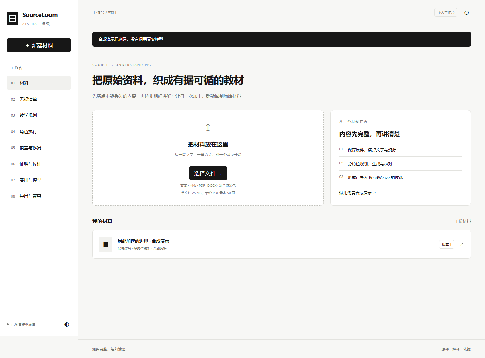
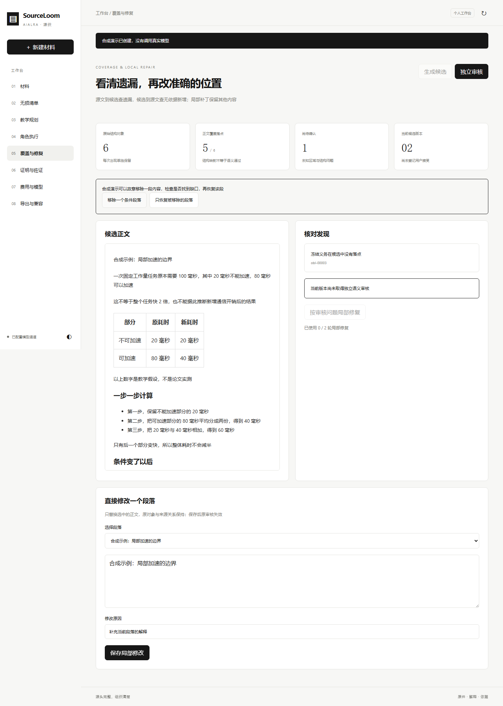

<div align="center">

<h1>AIALRA SourceLoom · 源织</h1>

<p><strong>把原始资料，织成有据可循的教材</strong></p>

<p>面向 ReadWeave 的内容预处理工作台 · 个人预览版 0.1</p>

[English](README.en.md) · [工作台（需登录）](https://sourceloom.aialra.online) · [完整计划](docs/MASTER_PLAN.md) · [验证报告](reports/IMPLEMENTATION_STATUS.md)

</div>

## 1 从材料到学习候选

SourceLoom 先保存原件、清点不能丢失的信息，再把规划、生成、审核和局部修复交给独立角色，最后形成能够导入 [ReadWeave](https://github.com/AIALRA-0/ReadWeave) 的学习候选

适合短文、指定章节和论文的内容准备，阅读、追问与知识积累继续在 ReadWeave 中完成

<div align="center">



图 1.1 本地真实工作台，画面只使用合成材料

</div>

## 2 已经能够做什么

- 保存原始文件字节，登记文本、图片、表格、公式源文、代码、链接和脚注对象
- 在生成前冻结保留义务，分别检查义务落点、来源片段和受保护对象
- 独立执行清单审核、教学规划、单元生成、语义审核、局部修复与调查规划
- 按准确旧文提交补丁，保留旧版本，拒绝过期、越界及超过两轮的修复
- 冻结后发现遗漏时归档完整旧状态，追加材料或义务，只为新增单元生成内容
- 通过人工任务包、本机 Codex、兼容接口或既有任务转发器执行角色
- 预留单篇费用，累计整站每日预算与调用次数，未知结果保留原调用身份
- 导出 ReadWeave 原生压缩包，配置连接后新增候选并读取正文、锚点和附件字节

<div align="center">



图 2.1 移除条件段落后实际触发的遗漏检查

</div>

## 3 五分钟得到第一个结果

需要 Python 3.11 或以上版本，先下载本仓库，在仓库根目录打开终端，使用独立环境运行

- 第一步，创建独立环境

```bash
python -m venv .venv
```

激活虚拟环境，Windows 使用 `.venv\Scripts\Activate.ps1`，其他系统使用 `source .venv/bin/activate`，随后安装项目

```bash
python -m pip install .
```

- 第二步，启动工作台

```bash
python -m sourceloom.cli serve
```

浏览器打开命令输出的本地地址，默认端口为 `8765`

- 第三步，点击「试用免费合成演示」，进入「覆盖与修复」，移除一个条件段落，再恢复它
- 第四步，进入「导出与兼容」，下载原生候选包，导入自己的 ReadWeave 测试父笔记

合成演示没有调用模型，能够验证操作与结构检查；它不代表模型改写质量已经通过

## 4 连接真实模型与中文写作标准

将 [配置示例](config.example.json) 复制到仓库外的私有位置，通过 `SOURCELOOM_CONFIG` 指定配置文件，通过 `SOURCELOOM_DATA` 指定材料目录

真实规划、生成和审核需要完整的 [中文技术写作技能](https://github.com/AIALRA-0/agent-human-readable-technical-writing)，将其本地目录填入 `writing_skill_dir`

该技能负责写作标准，SourceLoom 负责保存、分工、预算、验证和导入，规划、生成和审核的角色输入包含完整规则快照与摘要

首次连接建议使用很短的自有材料，保留默认单篇 0.50 美元、每天 2 美元、每天 80 次调用的限制，逐项检查结果后再调整

DeepSeek 的思考模式需要显式配置，默认高强度思考可能耗尽输出额度，实际试跑与配置依据见 [模型及预算方案](docs/MODELS_AND_BUDGET.md)

## 5 验证结果与当前边界

- 确定性测试共 107 项，包含 12 个独立合成领域样本的 5 种格式变体
- 真实浏览器走查覆盖桌面、平板、手机及明暗主题，共 32 项检查
- ReadWeave 原生导入已在实际实例读回，混合对象探针包含重复图片、合并单元格、代码和脚注跳转
- Sol 与 DeepSeek 均完成真实角色调用，成本、失败和尚未通过的审核分别保留，没有把调用完成写成内容验收通过

```bash
python -m pip install ".[test]"
python scripts/verify.py
```

验证脚本的等待上限为 120 秒，详细证据与限制见 [实施状态](reports/IMPLEMENTATION_STATUS.md)

原件完整、结构完整、语义忠实、导入后保持和用户愿意阅读，是不同的验收项

当前 PDF 与 DOCX 会保留明确的接入未知项；自动视觉核对、复杂公式排版、广泛真实文献质量对照及 ReadWeave 编辑器保存重开尚未完成全量验收，调查模式目前提供问题规划与指定来源接入

## 6 文档与部署

- [总计划与初衷](docs/MASTER_PLAN.md)
- [需求逐项对照](docs/REQUIREMENTS.md)
- [补漏版本与任务继续](docs/INCREMENTAL_WORKFLOW.md)
- [可检查性质与证明边界](docs/INVARIANTS.md)
- [阅读偏好与约束案例](docs/READING_PREFERENCES.md)
- [模型选择、测试预算与资源](docs/MODELS_AND_BUDGET.md)
- [已有项目的经验](docs/PROJECT_LESSONS.md)
- [部署与回滚](deploy/README.md)

生产实例采用既有统一登录，公开代码不包含原始私人附件、模型凭据、生产地址配置、数据库或登录记录

## 7 参与与安全

复现问题时优先提供合成材料、操作步骤、预期结果和实际结果，贡献方式见 [贡献指南](CONTRIBUTING.md)

发现涉及凭据或私人材料的问题时，先阅读 [安全说明](SECURITY.md)，不要把真实秘密贴进公开问题

项目使用 [Apache-2.0 许可证](LICENSE)，依赖与外部集成说明见 [第三方说明](THIRD_PARTY_NOTICES.md)
