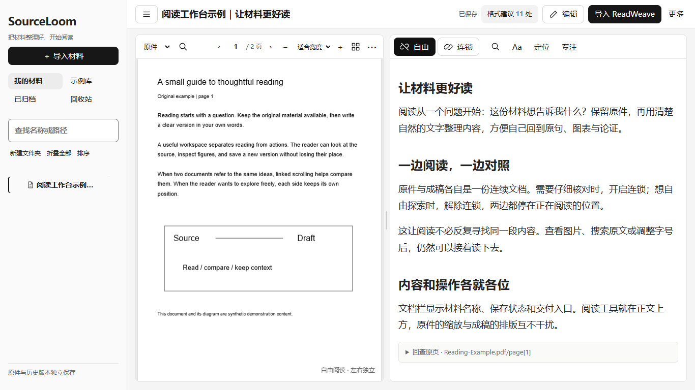

<div align="center">

<h1>AIALRA SourceLoom · 源织</h1>

<p><strong>保存原件，把模型返回稿整理成可对照、编辑和交付的图文材料</strong></p>

<p>材料处理工作台 · 本机使用或经认证的单用户远程服务</p>

<p><a href="README.en.md">English</a> · <a href="docs/PROCESSOR_V11_USE.md">使用说明</a> · <a href="deploy/README.md">生产部署</a> · <a href="SECURITY.md">安全说明</a></p>

</div>

## 1 当前产品

默认流程是导入完整原件、准备一个模型任务包、接收返回稿、恢复原图和来源位置，再阅读、编辑、导出或交给 ReadWeave

- 原件、模型返回和保存版本分别保留
- 文件树支持嵌套目录、多选移动、归档、回收站和恢复；改名与移动不改正文
- 原件连续阅读支持文字选择、查找、缩放和原页回查；双栏可自由阅读或双向连锁
- 图表问题通过预览和具体选项处理；机械检查不代替全文事实核验
- 手动与自动交接使用同一整理流程；实际通道必须具备所需附件能力

旧的多角色生成代码用于历史任务兼容，不是新材料的默认流程；正常使用处理器不需要启动旧生成 Worker

<div align="center">



图 1.1 当前工作台，仅展示合成材料的管理和阅读操作，不证明模型生成质量

</div>

## 2 本机启动

需要 Python 3.11 或更新版本，在仓库根目录执行：

```bash
# 创建独立运行环境
python -m venv .venv
```

- Windows：执行 `.venv/Scripts/Activate.ps1`
- macOS 或 Linux：执行 `source .venv/bin/activate`

```bash
# 安装产品与固定版本依赖
python -m pip install .
# 启动仅绑定本机的工作台
python -m sourceloom.cli serve --port 8765
```

打开 <http://127.0.0.1:8765/>；没有密钥也能导入、手动交接和本地导出，初次安装不会附带私人材料

默认数据保存在 `data/`，私有配置从 `.local/config.json` 读取；可用 `SOURCELOOM_DATA` 和 `SOURCELOOM_CONFIG` 指定位置。更换数据位置前停止对应服务并备份，不让多个服务同时写同一份库

正式站使用同一处理器，由一个网页服务配合已有 HTTPS 与登录代理提供；普通手动处理不需要生成 Worker。认证、必要材料迁移、正式环境链接及保留新写入的回滚步骤统一见 [生产部署说明](deploy/README.md)，仓库提交与 CI 成功不代表实例已经上线

## 3 完成第一份材料

- 第一步，点击「导入材料」选择原件，核对原文件、提取文字和实际资源
- 第二步，在模型交接页下载完整任务包并复制开始指令，在具有文件工具的会话中上传，按自己选择的档位处理
- 第三步，通过「导回成稿」上传 Markdown；处理器保存新版本并恢复资源，不要求手写图片路径
- 第四步，阅读成稿、对照原页并处理必要问题，操作说明见[阅读与材料管理](docs/PROCESSOR_V11_USE.md)
- 第五步，下载阅读包，或在明确配置目标后导入 ReadWeave；有可靠回执时可打开对应笔记

上传压缩包不等于模型已经解包和查看图片；xhigh 单包的完整真实会话能力仍待验证，不能凭档位名称保证附件支持

## 4 状态与数据边界

- Candidate 表示可保存、阅读和处理的候选稿；机械检查通过不自动升级为全文 Verified
- 扫描页可以回查原页，没有原生文字层时不声称已经完成文字识别
- UNKNOWN 保留原请求身份和费用，不作为自动重试许可
- ReadWeave 导入和读回需要外部配置；其初始化性能与 SourceLoom 阅读分别判断
- 删除默认进入回收站；永久删除另行确认，不联动删除 ReadWeave 笔记

原件、成稿、数据库、会话、私有配置和验收录像留在对应的私人运行环境；仓库提供代码、固定依赖、合成测试和必要静态资源。第三方许可见 [THIRD_PARTY_NOTICES.md](THIRD_PARTY_NOTICES.md)

## 5 开发与验证

```bash
# 安装合成测试依赖
python -m pip install '.[test]'
# 执行有界确定性测试，不调用付费模型
python scripts/verify.py
```

前端验证见 [CONTRIBUTING.md](CONTRIBUTING.md)；浏览器验收使用隔离材料，不向真实稿件插测试字，私人原件和运行现场不随公开测试分发

执行 Agent 的工程回报遵守 [开发协作入口](AGENTS.md) 与独立 [回报规范](docs/EXECUTOR_REPORTING_RULES.md)，不改变内容模型的写作要求

## 6 维护与许可

使用问题和改进建议提交到本仓库；凭据或私人材料按 [SECURITY.md](SECURITY.md) 处理。贡献方式见 [CONTRIBUTING.md](CONTRIBUTING.md)，项目许可见 [LICENSE](LICENSE)；依赖与原始材料的各自许可继续适用
