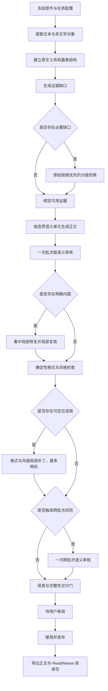

# SourceLoom 轻量生成链与 ReadWeave 能力复用执行计划

> 状态：已实施并部署
>
> 编制日期：2026-09-20
>
> 目标：在不把 SourceLoom 变成通用问答或重型研究系统的前提下，复用 ReadWeave 已验证的低成本接口、检索能力、格式约束、风格约束和测试闭环，降低每篇材料的生成成本，提高最终正文质量，并让设置、费用和交付状态可以检查。

## 1. 本轮只解决什么

SourceLoom 的职责保持不变：接收用户提供的网页、Markdown、PDF、DOCX 和其他常见资料，保留原始信息与非文字对象，把材料改写成更清楚、更连贯、可追溯并可导入 ReadWeave 的正文和阅读包。

本轮不增加通用问答、开放式课程设计或无边界研究。外部检索只补齐原文中真实存在、同时又影响理解或查证的缺口，例如正式术语的英文名称、缩写全称、内容型链接的目标内容、图表标签和必要背景。原文已经足够时，系统不搜索。

本轮达成四个直接结果：

1. 复用 ReadWeave 已配置的夸父社、TinyFish、OpenAlex、Octen 和 Parallel 等接口；夸父社承担已验证为兼容的低成本生成，完整结构化请求可按角色和尺寸切换到订阅中转或备用通道。
2. 把当前流程压缩成“规划一次、成稿一次、审核一次、按问题局部修复”的主链，删除没有证据收益的重复检查和全文重写。
3. 完整接入当前安装的 `human-readable-technical-writing` 技能、ReadWeave 的格式与风格规则，并用确定性检查承担可以机械判断的工作。
4. 增加服务器端设置窗口、真实费用账本、任务快照和可恢复的交付状态，让模型、接口、检索顺序和成本可以调整，但密钥不会进入浏览器、日志或导出包。

## 2. 设计原则

### 2.1. 原文义务先于扩充

系统先建立“原文必须保留什么”的清单，再决定怎么改写。清单覆盖段落、人称、条件、否定、数字、单位、公式、代码、表格、图片、链接、标题、按钮和其他界面标签。任何扩充都必须绑定到一个明确的原文义务或证据缺口。

### 2.2. 搜索由证据缺口触发

规划器只产生具体的证据缺口，不产生泛化的“研究主题”。每个缺口必须说明：缺什么、为什么影响当前正文、优先访问哪个原始链接、允许使用什么来源、找到什么便停止。没有证据缺口时，检索调用数为零。

### 2.3. 完整技能始终进入内容角色

规划、写作、语义审核和内容修复只要会改变正文，就必须读取并获得当前技能包的完整内容与摘要指纹。不得摘录成几个简化规则。确定性格式检查和纯传输适配不调用模型，也不需要重复发送技能文本。

### 2.4. 风格修复不得改变事实

事实、人称、范围、条件和结论服从原文；SourceLoom 的保真契约高于风格偏好；风格规则高于模型默认习惯。格式与风格问题只允许修改命中的局部范围，最多两轮，不再无条件重写全文。

### 2.5. 费用以真实状态记账

每次调用同时保存配置估算、无缓存上界、预留费用、供应商实际费用和结算状态。供应商尚未返回用量时显示“待结算”，不能按零元处理，也不能因为响应未知而自动重发。

## 3. 目标工作流

短材料的理想路径是一次规划、一次写作和一次语义审核；没有证据缺口时不搜索，确定性检查通过时不调用格式修复模型。这是优化目标，不是为了压低数字而牺牲内容的硬限制。长材料按连贯语义单元分批，不能按固定字数机械切碎。

只有出现下列情况，才执行一次跨批次语义审核：

- 代词或指代跨越两个批次；
- 条件、否定或结论的适用范围跨越两个批次；
- 术语首次定义的位置发生移动；
- 同一证据在不同上下文中承担不同作用；
- 某个单元进行了第二轮内容修复；
- 标题或正文节点发生较大顺序调整。

## 4. ReadWeave 能力如何复用

### 4.1. 接口注册表

在 SourceLoom 中建立独立的接口注册表，并从 ReadWeave 当前服务器配置执行服务器端导入。SourceLoom 保存自己的配置快照，不在运行时直接依赖 ReadWeave 数据库，避免一个项目改配置后另一个项目立即失效。

第一批接入以下能力：

| 能力 | 默认职责 | 初始策略 |
| --- | --- | --- |
| 夸父社 `deepseek-v4.1-flash` | 兼容范围内的规划、写作、审核和局部修复 | 低成本优先，使用兼容聊天协议；超出已验证的角色或尺寸边界时切换 |
| SourceLoom 订阅中转 | 完整结构化内容角色的备用通道 | 只在低价通道不兼容或不可用时启用，按订阅用量单独记账 |
| TinyFish | 普通网页搜索与页面取得 | 常规检索首选 |
| OpenAlex | 论文和学术元数据 | 仅在学术缺口出现时使用 |
| Octen | 检索备用 | 主检索失败或质量不足时使用 |
| Parallel | 备用与必要交叉核对 | 只有高风险缺口或前序失败时使用 |

ReadWeave 中其他已经配置的通道会进入设置窗口，但默认关闭，不自动加入主链。

夸父社的 `0.15` 是显示倍率。成本计算直接使用折后单价：每一百万令牌缓存命中约为 `0.054` 元、缓存未命中约为 `1.62` 元、输出约为 `4.86` 元。计算器不得再次乘以 `0.15`。价格、汇率和生效日期都作为版本化配置保存，后续可以在设置窗口修改。

### 4.2. 检索状态机

每个证据缺口依次经过以下状态：

1. `unresolved`：已发现缺口，尚未检索；
2. `direct_source`：原文已经提供目标链接，先打开目标页面；
3. `searched`：没有直接来源或直接来源不足，执行一次定向查询；
4. `opened`：打开最有可能回答缺口的结果；
5. `bound`：证据已经绑定到具体正文义务；
6. `unresolved_with_reason`：在调用上限内仍无法可靠确认，保存原因并阻止模型猜测。

搜索摘要不能直接作为事实证据。系统必须打开目标页面并保存标题、地址、取得时间、相关片段和支持的义务。默认每个缺口一次查询、一次打开；只有结果明显不相关或请求失败时，才允许各增加一次。相同地址全局去重。

### 4.3. 格式和风格规则

复用 ReadWeave 已验证的规则编号、样例和失败夹具，同时用 Python 在 SourceLoom 内实现，不引入运行时 TypeScript 服务依赖。规则覆盖：

- 正式术语的中英文证据对应；
- 名称内部缩写的展开；
- 图表、按钮和其他标签的解释；
- 内容型链接的目标说明；
- 纯排版资源的忽略；
- `1.`、`1.1.`、`1.1.1.` 的标题编号；
- 折叠与嵌套容器中的实际居中；
- 标点、括号、术语首次出现和受保护对象。

原文中的代码、公式、链接地址、资源地址和其他受保护范围先被标记，规则检查与补丁不能破坏这些范围。

## 5. 设置窗口

文库页面增加一个清楚但不抢占正文空间的“设置”入口。设置只通过服务器端管理接口读写，浏览器只能看到脱敏值。

### 5.1. 接口设置

显示接口名称、用途、启用状态、优先级、协议、地址、模型、脱敏密钥、最近探测时间、延迟、错误和配额状态。可以新增、编辑、停用和探测接口。

### 5.2. 检索设置

分别配置普通网页、直接页面、学术搜索和备用核对的顺序、调用上限与停止条件。

### 5.3. 生成设置

配置工作流版本、风格配置、标题编号、材料配图默认折叠状态、内容修复上限、格式修复上限、跨批次审核开关和发布策略。默认生成后进入“待用户审阅”，不自动发布。

### 5.4. 成本设置

显示输入、缓存输入、输出单价，显示倍率、汇率、价格版本、单篇软提醒和当前任务的预计上界。软提醒只提示，不截断正文或牺牲必要步骤。

### 5.5. ReadWeave 导入

提供“从 ReadWeave 同步”操作。同步前展示差异，写入草稿配置，探测通过后原子切换为启用状态。已有运行任务继续使用启动时冻结的接口、价格、技能和风格指纹；新配置只影响新任务。

配置状态统一为 `draft → probed → active`。密钥永远不通过公共 `/api/config` 返回，不写入调用日志、错误详情、前端缓存或导出包。

## 6. 费用和调用控制

每个任务保存以下数据：

- 各阶段的调用次数、输入令牌、缓存命中令牌和输出令牌；
- 搜索、页面取得、图像识别和模型生成的独立费用；
- 配置估算、无缓存上界、预留金额、供应商实际金额和结算状态；
- 接口、模型、价格、汇率、技能包和风格规则的版本指纹；
- 超时、响应未知、解析失败和确定失败的区别。

调用上限按工作性质拆开：

| 环节 | 默认上限 | 硬上限 |
| --- | ---: | ---: |
| 传输或结构纠正 | 0 次 | 1 次 |
| 单个证据缺口查询 | 1 次 | 2 次 |
| 单个证据缺口页面取得 | 1 次 | 2 次 |
| 单元内容修复 | 1 轮 | 2 轮 |
| 格式与风格修复 | 1 轮 | 2 轮 |
| 跨批次语义审核 | 按风险触发 | 1 次 |

内容修复与格式修复共享同一批次的补丁计数器，默认一轮、最多两轮，不会叠加成四轮。

超时或送达状态未知时保存检查点，等待人工或供应商状态确认，不自动重发。重新启动任务时从最后一个已确认检查点继续，避免重复付费。

## 7. 实施阶段

### 7.1. 第一阶段：冻结基线和安全边界

1. 固定当前生产版本、数据库和配置备份；
2. 记录现有流程的调用量、费用、耗时和已知质量问题；
3. 把密钥脱敏、任务快照、未知响应不重发和回滚路径写成自动检查；
4. 为新流程增加功能开关，保留旧流程作为临时回滚路径。

完成标准：不改变当前生产行为；配置和密钥测试全部通过；能够在同一份原件上离线重放历史结果。

### 7.2. 第二阶段：接口注册表、Responses 协议和费用账本

1. 增加 ReadWeave 配置导入器和 SourceLoom 独立注册表；
2. 接入夸父社 Responses 请求、流式或非流式响应、用量字段和错误语义；
3. 接入真实费用账本和价格版本；
4. 完成设置窗口中的接口、成本和探测页面。

完成标准：每个启用接口各执行一次轻量探测；密钥不出现在浏览器和日志；夸父社折后价格不会重复乘倍率；服务重启后配置仍可恢复。

### 7.3. 第三阶段：证据缺口和分级检索

1. 在现有原文义务结构上增加 `EvidenceGap`、`EvidenceBinding` 和 `EvidenceResolution`；
2. 原文已经提供的内容型链接按页面取得上限批量预取并全局去重；普通搜索仍只由证据缺口触发；
3. 接入 TinyFish、OpenAlex、Octen 和 Parallel 适配器；
4. 实现直接链接优先、按缺口查询、打开证据后绑定和达到答案即停止；
5. 在设置窗口开放顺序、上限和启停配置。

完成标准：完整原文不产生搜索请求；包含内容型链接或缩写缺口的材料只查询对应缺口；搜索摘要不能直接进入正文证据；重复地址只取得一次。

### 7.4. 第四阶段：压缩生成链并固化格式风格

1. 把规划、写作、批次审核、内容补丁、格式补丁和跨批次审核整理成明确状态机；
2. 规划尽量一次完成，只有长文档才按语义边界分区；
3. 完整加载当前技能包，并记录技能指纹；
4. 移植 ReadWeave 的确定性规则、受保护范围和局部补丁协议；
5. 统一“待用户审阅、已接受、已发布”状态，未完成语义审核的内容不能伪装成可发布结果；
6. 让进度页面显示当前阶段、已完成义务、证据缺口、调用数、费用和可恢复检查点。

完成标准：短材料的正常路径不出现全文格式重写；每个局部补丁都有问题编号和精确范围；两轮仍未解决时保留候选与原因，不继续烧调用；发布状态与检查结果一致。

### 7.5. 第五阶段：离线回归和新真实材料测试

先执行不产生模型费用的测试：

1. Responses 请求、返回、错误、超时和未知用量夹具；
2. 价格、缓存命中、未结算和倍率计算；
3. 密钥脱敏、配置原子切换和任务快照；
4. 证据缺口、停止条件、地址去重和检查点恢复；
5. 术语、缩写、编号、图表标签、内容型链接、纯排版资源和居中规则；
6. 代码、公式、数字、单位、链接和图片资源的无损检查；
7. 历史失败结果与冻结检索结果的离线重放。

真实材料分两批，每份材料只进行一次付费生成，不重复使用以前测过的材料：

| 批次 | 新材料类型 | 数量 |
| --- | --- | ---: |
| A | 含内容型链接的技术网页、含嵌套列表与代码的 Markdown、普通论文 PDF、含多图 PDF | 4 |
| B | 含表格与图片的 DOCX、代码文档、含公式与单位的材料、较长的图文混合文章 | 4 |

初始并发为 `2`。确认没有限流、任务串扰或进度卡顿后，最高提高到 `4`。A 批发现的通用问题先通过离线夹具和局部代码修复，再用四份全新的 B 批材料验证，不能把同一材料反复生成到看起来通过。

每份材料保留：原件、最终正文、引用证据、调用明细、实际或待结算费用、耗时、所有检查结果和浏览器截图。失败样本同样保留，不能从报告中删除。

### 7.6. 第六阶段：候选部署、浏览器验收和生产切换

1. 在生产服务器部署带功能开关的候选版本；
2. 用真实浏览器完成“上传 → 后台进度 → 最终正文 → 双向定位 → 编辑 → 历史版本 → 导出 → ReadWeave 导入并读回”；
3. 验证设置窗口、接口探测、进度刷新、图片折叠、表格与图片居中、下拉框隔离和长文性能；
4. 检查移动端与桌面端的基础布局；
5. 全部阻断项通过后切换生产流量，同时保留一键回滚到旧流程的能力；
6. 提交并推送 GitHub，部署生产版本，更新项目文档和变更记录。

## 8. 验收标准

### 8.1. 内容质量

- 数字、单位、公式、代码、链接、条件、否定和人称没有丢失或被改写成其他含义；
- 不为改写任务凭空设置教学情境；原文属于教学材料时，解释顺序能够承上启下；
- 正式术语有证据支持的中英文对应，名称内部缩写按规则展开；
- 内容型链接得到与当前上下文相称的解释，纯排版占位资源不会被当作知识点；
- 图片、表格和界面标签得到必要说明，不大段重复搬运英文原文；
- 同一篇文章的标题、编号、术语、段落节奏和资源样式统一。

### 8.2. 成本和效率

- 报告每篇文章的总费用、每一万原文字数费用和各阶段调用费用；
- 同时报告首次可接受率、内容修复次数、格式修复次数、搜索次数和缓存命中情况；
- 没有证据缺口的材料搜索费用为零；
- 没有格式问题的材料格式模型费用为零；
- 超时或送达未知不会产生自动重复调用；
- 供应商未结算的调用明确显示，不能被统计为免费。

### 8.3. 产品与运行

- 设置窗口可以管理并探测接口，所有密钥脱敏且重启后可恢复；
- 任务关闭前台后继续运行，重新打开能够恢复准确进度；
- 每个任务固定自己的接口、价格、技能和风格版本；
- 未审核内容只能处于“待用户审阅”，不能直接标记为发布成功；
- 原件、正文、历史版本、阅读包和 ReadWeave 导入结果都可以实际取得；
- 生产出现阻断问题时可以回滚，旧任务不会被新配置破坏。

## 9. 开发协作方式

实现时使用多个子代理处理边界清楚、可以独立验证的工作：

- Luna 负责接口适配、费用账本、设置界面、规则夹具和真实样本整理；
- Sol 负责系统边界、数据契约、关键语义判断、合并审核和最终修正；
- 只有遇到 Luna 无法可靠判断的复杂语义或跨模块问题，才升级给 Terra 或 Sol。

这些角色只用于开发与测试，不会变成生产工作流中的额外模型调用。

## 10. 审核后执行顺序

用户批准本计划后，按“第一阶段至第六阶段”连续执行。每一阶段的检查通过后直接进入下一阶段，不为普通实现选择反复请求确认。只有发现会改变产品边界、需要删除用户数据或无法安全回滚的事项，才单独报告。

最终交付不是中间日志或抽象评分，而是：可访问的生产版本、从未用于此前测试的真实输入及其逐份结果、逐篇费用、完整调用明细、可复现的检查报告、GitHub 提交和部署版本。用户随后可以直接上传自己的材料进行现场体感测试。
