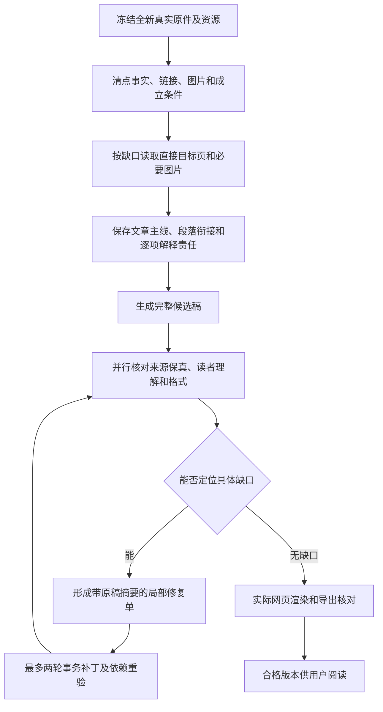

# 第十一轮：用新材料验证完整改写与自动修复

用户已批准实施；本文同时保留原执行计划和实施边界，本轮只对未用于生成的新真实材料发起新任务，旧材料仅用于不调用模型的回归核对

## 1. 这次反馈暴露了什么

目前两条旅行商问题链接的说明在第一次生成时已经是一条长列表项，随后两轮局部补丁均未修改它们，故问题先出在写作和首次审核，不能归咎于补丁把好稿压坏

- 环游数量链接把计算过程挤进一行，却没有先让读者明白正在数什么、为什么反向路线算同一条，以及这个数量和当前页面所说的求解困难有什么关系；目标页还明确提醒，候选路线数量巨大只能排除逐条检查，不能单凭数量证明问题难解，现稿漏掉这一限定，见[目标页](https://www.math.uwaterloo.ca/tsp/problem/pcb3cnt.html)
- 圣诞老人链接仅交代标题、日期和报纸来源，目标页的主要内容是一张报纸图片，现有网页文字读取无法说明图片中的文章实际讲了什么；没有完成图像读取时，不应把书目信息当成知识解释，见[目标页](https://www.math.uwaterloo.ca/tsp/problem/santa.html)
- 当前写作提示已要求解释链接，审核提示也要求核对链接的主题、关联和目标内容，但规划义务、模型回答与审核结果之间缺少可验证的三项对应；结构通过和引文准确都不能证明读者无需猜测
- 当前对所有问题共享至多两轮局部补丁，耗尽后保存待处理稿；这符合技能的修复上限，却不能把仍有理解缺口的稿件标为最终质量合格

这里没有把用户反馈当成该材料的再次生成许可，旧稿只用于只读归因和无模型回归夹具

## 2. 借鉴 Course OS 与 ReadWeave

Course OS 当前将计划、开篇、讲解和总结分别保存为恢复点，检查结果转换为带字段名和原值摘要的修复单，仅允许修改出错字段，随后重验结构、覆盖与数学内容，见其 `docs/generation-recovery.md` 与 `apps/api/src/generation-repair.ts`

ReadWeave 当前保存需求、资料、构造流和正文的阶段恢复点；已经读过的资料不会因格式修复再检索，格式补丁只作用于能够唯一定位且未破坏受保护内容的片段，见其 `docs/readweave-active-research.md` 与 `apps/server/src/services/readweave_active_pipeline.ts`

SourceLoom 采用这两者共同的恢复点、版本核对、最小作用域和依赖重验原则，同时保留自己的原件清单、段落来源和多媒介处理，不能直接复制面向单页课程或单次问答的数据结构

## 3. 目标工作流

正文首次生成前，每个知识链接生成三个明确责任：它指向什么主题、为什么出现在当前位置、目标页实际给出了什么及什么不能由此推出；目标内容是图片时先取得图像证据，再决定怎样解释，读取失败须保留真实状态，不编造内容

读者理解核对要能指出正文中对应的短句和来源位置，逐项检查读者能否说出对象、前提、过程、结论与限制；对一行塞入多个独立事实的情形，检查是否需要分项或自然段，但不能为追求短句拆断连续因果解释

修复单分别限定在资料缺口、规划遗漏、正文解释、格式呈现四类，先定位最早失效阶段，不能把所有问题都交给末端改句模型；补丁带旧文本、段落身份、版本摘要、允许范围和直接依赖位置，拒绝过期、跨段落或改动原件的提交

没有完成核对的候选稿仍保存为可恢复草稿，后台自动完成允许的修复；质量合格的状态只授予实际通过同一版本所有必需核对的稿件，遇到无法查证或两轮后仍有影响理解的问题时保留真实状态，不声称已经全部通过

## 4. 成本与失败恢复

- 资料读取按具体缺口触发，同一链接和同一图片在同一任务内只保存和解释一次，已验证的原件、计划和正文阶段按摘要复用
- 优先用已配置的低价模型完成资料整理和明确范围的局部补丁，复杂语义判断才比较更强模型；以整篇合格稿的实际人民币费用和调用数比较，不用每百万计费单位标价替代质量比较
- 供应商明确返回额度用尽后，在该任务的后续调用中停止重复探测这条不可用路线，转入已授权的备用通道；未知送达的请求先查询原记录，不盲目重发
- 记录每阶段输入、输出、缓存、人民币估算、失败调用、模型、延迟和修复次数；前置检查只阻止可确定的坏稿，不通过删减完整技能、原文事实或固定截字来降费
- 保持现行至多两轮的局部补丁上限，先把同类问题合入第一次审核和第一次补丁；如果两轮仍有实质缺口，保存已做的工作并准确标记，不把不可修复说成成本优化成功

## 5. 实施顺序与验收

1. 为全新输入建立去重登记，按来源地址、原件摘要和处理记录排除以前进入过模型生成的网页、论文、文档及其等价副本；旧案例只运行不调用模型的回归检查
2. 先补目标页与图片的证据表示，再补规划责任，保证链接解释不是从标题猜出来；相同证据在后续审核和局部修复中复用
3. 再接入读者理解核对和按最早失效阶段派发的修复单，保存阶段恢复点与补丁事务，修复后核对被改段落、相邻衔接、相关术语及来源限制
4. 最后改进前台状态：后台持续处理和恢复，默认只把通过所有必需核对的版本标为可阅读的最终稿；其余版本保留真实进度和问题位置，不让用户替系统逐项排查
5. 使用此前没有生成过的真实网页、以图像承载关键内容的页面、带公式的论文或 PDF、Markdown 或文档各至少一份，先核查地址与摘要，再锁定样本；每份都看实际输入、下载后的完整正文、网页渲染和来源跳转，不用合成文本充当质量验收
6. 对每份新材料记录首次生成质量、自动修复前后差异、来源事实覆盖、英文名称证据、图像与表格说明、段落衔接、真实费用和用时；至少一份经过实际局部修复且保留未命中段落原文，再验证服务重启后能够从恢复点继续

验收以最终可读稿为准：每个重要源事实都有正文落点，新增解释有依据，链接内容及限制讲清，图片和公式能跟着读，段落过渡自然，页面与导出一致；自动检查通过只算其中一部分，实际阅读核对仍不能被模型自评或计数替代

本轮计划不承诺任意未来材料都绝无缺陷；它要求下一轮对锁定的新真实样本完成内部闭环，只有达到上述标准的实际成稿才作为成功案例交付
