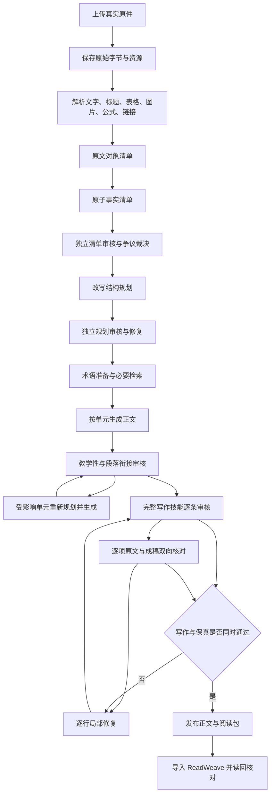
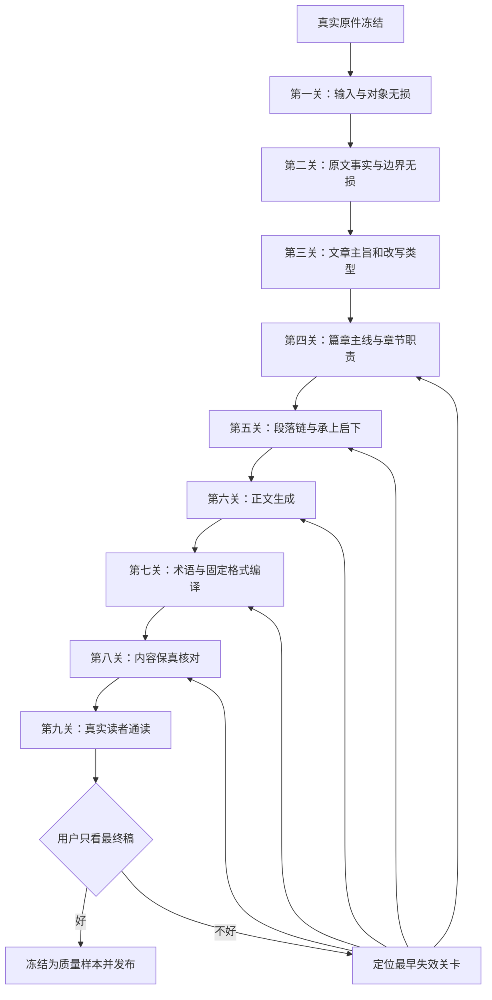
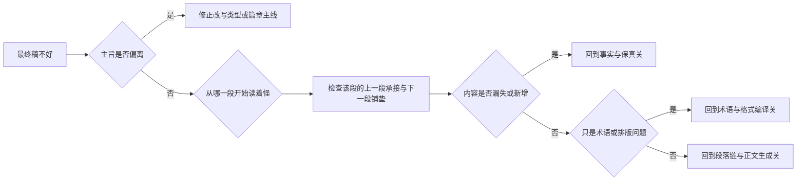

# SourceLoom 全工作流与逐环节诊断

## 1 用户只需要判断最终质量

用户不需要理解事实编号、格式规则编号、模型通道或修复轮次

每次人工验收只回答三个问题：

1. 这份最终稿整体好不好
2. 从哪里开始读着不对
3. 更接近「漏了原文」「讲乱了」「写得怪」「排版难看」中的哪一种；无法分类时直接描述感受

系统负责把反馈回溯到出错环节，并生成能够复现的自动检查

## 2 当前生产工作流

## 3 当前框架真正的问题

### 3.1 末端审核承担了过多责任

写作审核同时检查数百条条件规则，原文核对同时检查全部原文对象、事实和正文块。两者虽然分组执行，但每轮局部修复后仍要重新检查完整成稿

结果是同一问题可能换一种说法再次出现，审核模型也可能在不同轮次给出不同判断，问题数因此上下波动。问题数波动不能直接说明正文变好或变坏

### 3.2 局部修复接收的是混合问题

一次修复可能同时收到以下意见：

- 原文信息遗漏
- 人称或指代改变
- 段落衔接不足
- 术语首次定义不完整
- 英文配对或缩写格式错误
- 标题、列表或图片版式问题

这些问题需要不同的修复方式。把它们交给同一个逐行修复角色，会让角色在一行中承担过多目标，也可能在解决格式问题时改变内容关系

### 3.3 规划通过不等于阅读体验通过

当前规划能证明事实被分配到某个单元，却不能充分证明读者会怎样从上一段自然走到下一段

「事实都在」与「读起来循循善诱」是两种不同的验收。后者需要明确的篇章主线、段落功能和相邻段落关系，不能只在成稿末端补救

### 3.4 写作技能被当成末端审核表

完整技能已经提供给每个角色，但很多规则只在末端被发现。更稳定的做法是把能够确定执行的规则变成生成器约束、术语编译器和排版器行为，让模型只判断真正依赖语义的部分

### 3.5 缺少一个稳定的人类质量锚点

系统保存了大量自动证据，却没有把用户的「这版好」「这版怪」变成稳定的对照样本。没有这个锚点，自动审核可能越来越严格，却离用户真正喜欢的阅读体验越来越远

## 4 建议重构后的工作流

每一关只负责一种问题，并产生稳定、可保存、可比较的产物

| 关卡 | 输入 | 输出 | 失败时回到哪里 |
|---|---|---|---|
| 输入与对象无损 | 原文件 | 原始字节、资源清单、对象顺序 | 解析器 |
| 事实与边界无损 | 原文对象 | 事实、条件、否定、人称、指代、数量 | 清单器 |
| 主旨和改写类型 | 用户目标、原文 | 改写边界；是否允许教学、补充和检索 | 任务路由 |
| 篇章主线 | 事实清单 | 每节职责、先后关系、不能偏离的主线 | 规划器 |
| 段落链 | 篇章主线 | 每段功能、上一段承接、下一段铺垫 | 衔接规划器 |
| 正文生成 | 段落链、事实 | 完整初稿 | 对应段或章节生成器 |
| 术语与格式编译 | 完整初稿、完整技能 | 统一术语、缩写、标点、标题和资源格式 | 确定性编译器或局部语义修复 |
| 内容保真 | 原文、最终候选 | 逐项保留与反向来源证明 | 最早出错的正文段 |
| 真实读者通读 | 同一版完整候选 | 主线、节奏、衔接和阅读负担结论 | 篇章主线或段落链 |

## 5 从哪里开始

先从「篇章主线与段落链」开始，不从术语格式或更多模型开始

原因如下：

- 用户已经认可当前内容质量，主要不满是文章偶尔偏离主旨、段落之间缺少承接，以及整体看起来不统一
- 术语、缩写、标点和资源显示可以在后面稳定编译，不应反过来决定文章怎样讲
- 如果篇章主线本身不对，末端逐行修复越多，正文越容易变成每段单独正确、整篇仍然奇怪
- 一份中等长度真实材料足以看清规划、段落链、生成和保真之间的问题，不需要同时观察四份材料和数百条问题

## 6 第一轮逐关实验

先用用户已经看过并指出过问题的 MDN Function 材料作为诊断样本。它适合快速确定主旨、篇章主线、段落链与正文生成之间的责任边界

这一份通过后，再用包含图片和复杂页面结构的 TSP 网页验证相同工作流，最后扩展到长 PDF 与 Word 文档

系统内部保存原文对象、事实清单、改写边界、篇章主线、段落链、初稿、格式编译结果与保真证据。用户页面默认只展示两份内容：

1. 可以框选和高亮定位的原文
2. 当前唯一的完整候选稿

用户只判断完整候选稿，并指出第一处开始读着不对的位置。系统不得要求用户阅读结构稿、规则编号、问题数量或模型日志

收到判断后，系统按以下顺序定位：

## 7 人工反馈怎样进入系统

人工反馈不直接变成一条临时提示词，而是保存为四部分：

- 触发位置：用户从哪一段开始感到不对
- 感受原话：保留用户自己的描述
- 系统定位：最早失效的工作流关卡
- 回归样本：相同问题的原稿、坏稿、修正稿和自动检查

下一次处理任何材料时，系统先运行这些回归样本，再进入真实生成。这样用户只需要判断结果，框架负责积累经验

## 8 怎样逐环节找出问题

逐环节检查由系统完成，不把不同环节的中间稿依次交给用户

系统从用户指出的位置向前追溯，并找到错误第一次出现的产物：

| 最早出现错误的产物 | 负责环节 | 典型问题 |
|---|---|---|
| 解析对象 | 输入与对象无损 | 图片、表格、代码或链接丢失 |
| 事实清单 | 事实与边界无损 | 否定、条件、数值、人称或指代丢失 |
| 改写边界 | 主旨和改写类型 | 把改写做成教学，加入原文没有的情境 |
| 篇章主线 | 篇章主线 | 章节顺序正确但文章不知道要带读者去哪里 |
| 段落链 | 段落链 | 相邻段落各自正确，却没有承接和铺垫 |
| 初稿 | 正文生成 | 规划正确，具体句子仍然生硬或扩写过多 |
| 编译稿 | 术语与格式编译 | 术语、大小写、标题、列表或资源版式不统一 |
| 保真报告 | 内容保真 | 原文信息没有对应位置，或成稿出现无来源主张 |

每次只修复最早失效的环节，然后重新生成一份完整候选稿供用户判断。后面的环节不得用局部润色掩盖前面已经发生的结构错误

## 9 本轮暂不继续扩大的内容

在一份基准材料走通以前，不继续增加新的审核角色、规则轮次或并行材料。现有真实任务和原响应继续保存，不把中间候选冒充最终成品
